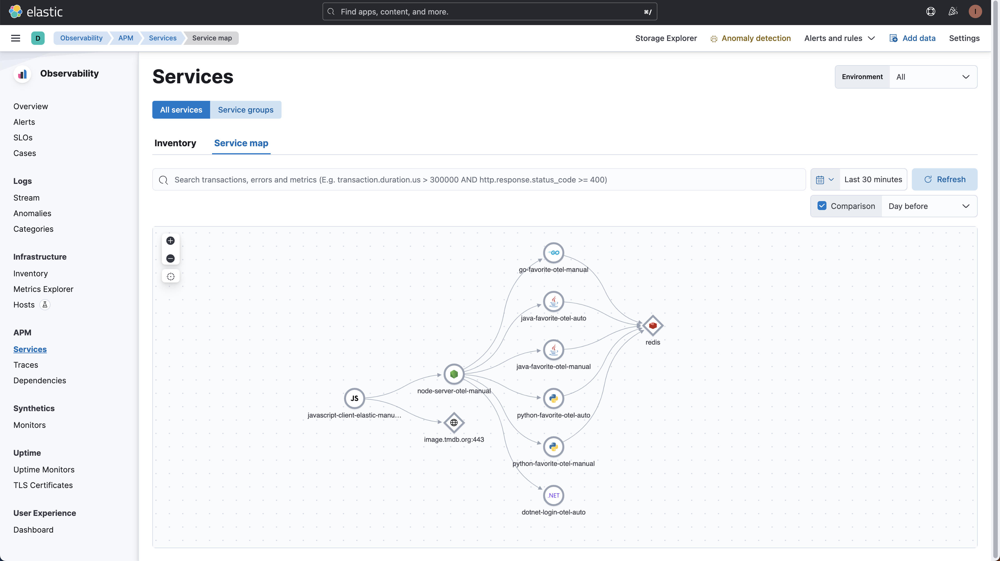
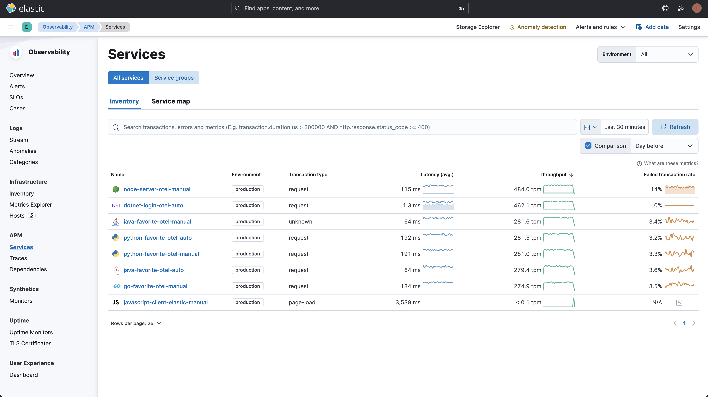

# Elastiflix Demo Application

## Overview

This demo application is a simple movie app that allows you to add movies to your favourites list. 
The repository provides all possible permutations of the application, instrumented with Elastic APM, OpenTelemetry, or not instrumented at all.

You can compare the code samples and Dockerfiles to better understand what it takes to instrument an application with Elastic APM or OpenTelemetry.





## Setup

add your Elastic deployment details and credentials to the .env file:

`.env` file in same directory as compose files:

```
ELASTIC_APM_SERVER_URL="https://foobar.apm.us-central1.gcp.cloud.es.io"
ELASTIC_APM_SECRET_TOKEN="secret123"

ELASTICSEARCH_USERNAME="elastic"
ELASTICSEARCH_PASSWORD="changeme"
ELASTICSEARCH_URL="https://foobar.es.us-central1.gcp.cloud.es.io"
```

## start the app:

You can start the app in 3 different ways and also with different scenarios. See below for the scenarios.

Not instrumented:
```
cd Elastiflix
docker-compose -f docker-compose.yml up -d --no-build

```
Elastic instrumented:
```
cd Elastiflix
docker-compose -f docker-compose-elastic.yml up -d --no-build
```
OpenTelemetry instrumented:
```
cd Elastiflix
docker-compose -f docker-compose-elastic-otel.yml up -d --no-build
```

then visit the app at `localhost:9000` 

the add favourites button is the main functionality right now. It calls the node service which then calls the python service

# Supported Languages


|  language | non instrumented  | elastic manual  | elastic auto  | otel manual  | otel auto  |
|---|:---:|:---:|:---:|:---:|:---:|
| python  | [x] | [x] | not supported | [x] | [x] |
| dotnet  | [x] |   | [x] |   | [x] |
| node  | [x] |[x]| not supported | [x] | [x] |
| javascript  | [x] | [x] | not supported | [ ]| not supported |
| Go  | [x] | [x] | not supported | [x] | not supported  |
| java  | [x] | [x] | [x] | [x] | [x] |

## Example Scenarios

### Non Instrumented
``````
# healthy
docker-compose -f docker-compose.yml up -d

# pause redis for 5 seconds, every 30 seconds
TOGGLE_CLIENT_PAUSE=true docker-compose -f docker-compose.yml up -d

# add artificial delay to python service, 100ms, delay 50% of requests by 1000ms
TOGGLE_SERVICE_DELAY=100 TOGGLE_CANARY_DELAY=1000 docker-compose -f docker-compose.yml up -d

# add artificial delay to python service, 100ms, delay 50% of requests by 1000ms, and fail 20% of them
TOGGLE_SERVICE_DELAY=100 TOGGLE_CANARY_DELAY=1000 TOGGLE_CANARY_FAILURE=0.2 docker-compose -f docker-compose.yml up -d

# throw error in nodejs service, 50% of the time
THROW_NOT_A_FUNCTION_ERROR=true docker-compose -f docker-compose.yml up -d 
``````

### Elastic
``````
# healthy
docker-compose -f docker-compose-elastic.yml up -d

# pause redis for 5 seconds, every 30 seconds
TOGGLE_CLIENT_PAUSE=true docker-compose -f docker-compose-elastic.yml up -d 

# add artificial delay to python service, 100ms, delay 50% of requests by 1000ms
TOGGLE_SERVICE_DELAY=100 TOGGLE_CANARY_DELAY=1000 docker-compose -f docker-compose-elastic.yml up -d

# add artificial delay to python service, 100ms, delay 50% of requests by 1000ms, and fail 20% of them
TOGGLE_SERVICE_DELAY=100 TOGGLE_CANARY_DELAY=1000 TOGGLE_CANARY_FAILURE=0.2 docker-compose -f docker-compose-elastic.yml up -d

# throw error in nodejs service, 50% of the time
THROW_NOT_A_FUNCTION_ERROR=true docker-compose -f docker-compose-elastic.yml up -d 
``````

### OpenTelemetry
``````
# healthy
docker-compose -f docker-compose-elastic-otel.yml up -d

# pause redis for 5 seconds, every 30 seconds
TOGGLE_CLIENT_PAUSE=true docker-compose -f docker-compose-elastic-otel.yml up -d 

# add artificial delay to python service, 100ms, delay 50% of requests by 1000ms
TOGGLE_SERVICE_DELAY=100 TOGGLE_CANARY_DELAY=1000 docker-compose -f docker-compose-elastic-otel.yml up -d

# add artificial delay to python service, 100ms, delay 50% of requests by 1000ms, and fail 20% of them
TOGGLE_SERVICE_DELAY=100 TOGGLE_CANARY_DELAY=1000 TOGGLE_CANARY_FAILURE=0.2 docker-compose -f docker-compose-elastic-otel.yml up -d


# throw error in nodejs service, 50% of the time
THROW_NOT_A_FUNCTION_ERROR=true docker-compose -f docker-compose-elastic-otel.yml up -d 
``````

### Scenario / Feature Toggles


|  service | env  | type | values | description  | 
|---|:---:|:---:|:---:|:---|
| redis | TOGGLE_CLIENT_PAUSE  | bool | true / false | pause redis for 5 seconds every 30 seconds to cause artificial delays  |
| python | TOGGLE_SERVICE_DELAY  | int | 0-5000 | artificial delay in milliseconds for all requests  |
| python | TOGGLE_CANARY_DELAY  | int | 0-5000 | artificial delay in milliseconds for canary requests (50% of all POST /favorite requests)  |
| python | TOGGLE_CANARY_FAILURE  | float | 0-1 | artificial failure rate for canary requests |
| node   | THROW_NOT_A_FUNCTION_ERROR  | bool | true / false | throw an error in the node service for 50% of all POST /api/favorite requests  |
